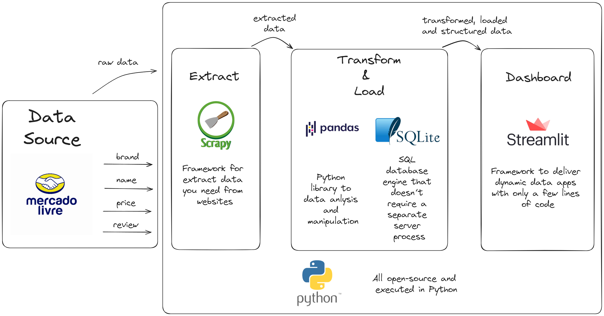

# Web Scraping with Scrapy

## Project Summary

This project represents a practical scenario in which a major shoe company aims to analyze the shoe market on [Mercado Livre](https://lista.mercadolivre.com.br/tenis-corrida-masculino) to develop a competitive pricing strategy.

### **Company Goals:**

- Identify the most prominent brands across the first 20 pages of search results.
- Calculate the average price of athletic shoes by brand.
- Assess customer satisfaction for each brand (based on reviews).

To achieve these objectives, we'll implement a **ETL (Extract, Transform, Load) pipeline** using Python and widely-used open-source libraries:

- **Extraction:** Utilize the `Scrapy` framework to scrape product data from Mercado Livre.
- **Transformation:** Use `pandas` to clean and format the raw data into structured DataFrames.
- **Loading:** Store the processed data in an `SQLite3` local database.
- **Visualization:** Present insights through an interactive dashboard built with `Streamlit`.

### **Environment Setup and Library Installation:**
```bash
conda create -n scrapy-env
conda activate scrapy-env
conda install scrapy pandas streamlit
```

## 1. Data Extraction using Scrapy

### **1.1. Project Initialization**

- Start a Scrapy project with the following command:
```bash
scrapy startproject collect
```

- Move into the project folder and create a spider for scraping:
```bash
cd collect
scrapy genspider mercadolivre https://lista.mercadolivre.com.br/tenis-corrida-masculino
```

The spider will be responsible for sending requests, parsing the necessary data, and handling pagination.

### **1.2. Configuring Scrapy (`settings.py`)**

To ensure proper access, set up your user agent:
```python
USER_AGENT = 'your_user_agent'
```
>You can find your user agent by searching "my user agent" online.

Disable the `robots.txt` rule to allow scraping multiple pages:
```python
ROBOTSTXT_OBEY = False
```

### **1.3. Spider Testing in the Terminal**

Scrapy allows testing commands directly in the terminal:
```bash
scrapy shell
```

For example:
```bash
fetch('https://lista.mercadolivre.com.br/tenis-corrida-masculino')
```
This will fetch the HTML content of the page.

Some useful commands for parsing:
- To capture the HTML block containing relevant product information:
```bash
response.css('div.ui-search-result__content')
```

- To count the number of items within the block:
```bash
len(response.css('div.ui-search-result__content'))
```

- Assign the content block to a `products` variable for further parsing:
```bash
products = response.css('div.ui-search-result__content')
```

- Extract brand names from the content:
```bash
products.css('ui-search-item__brand-discoverability ui-search-item__group__element::text').get()
```

- To exit the shell:
```bash
exit()
```

### **1.4. Spider Script (`mercadolivre.py`)**

After performing terminal tests, proceed with writing the scraping logic within the `parse` method in the `mercadolivre.py` spider.

### **1.5. Running the Spider**

Execute the spider to gather data and save the results in a JSON Lines file:
```bash
scrapy crawl mercadolivre -o .data\data.jsonl
```

## 2. Data Transformation and Loading with pandas and SQLite

Use the `main.py` script located in the `transformation` directory to handle data transformation and loading.

First, read the `data.jsonl` file generated by Scrapy using `pandas`.

The transformation process includes handling missing values (converting `NULL` to `0`), adjusting data types, and combining price values (e.g., combining reais and cents into a single price column).

After cleaning the data, establish a connection to the SQLite3 database (`quotes.db`) and load the processed data into a table (`mercadolivre_itens`). SQLite operates directly on your machine, which simplifies the setup since no external server is needed.

Run the transformation and loading steps with:
```bash
python transformation/main.py
```

## 3. Creating the Dashboard with Streamlit

We'll develop the dashboard in `app.py`. First, connect to the SQLite database to retrieve the scraped and transformed data.

Next, design the layout of the Streamlit dashboard. The dashboard includes 3 Key Performance Indicators (KPIs) to summarize important insights for the client:
- Total number of products;
- Count of unique brands;
- Average price (new price).

Additionally, charts and tables are created to answer key business questions:
- What brands dominate the listings across multiple pages?
- What is the average price by brand?
- How does customer satisfaction vary across brands?

Run the Streamlit app to view the dashboard:
```bash
streamlit run dashboard/app.py
```

---

### **Note:**

All commands for:

1. Data extraction:
```bash
scrapy crawl mercadolivre -o data.jsonl
```
2. Data transformation and loading:
```bash
python transformation/main.py
```
3. Dashboard visualization:
```bash
streamlit run dashboard/app.py
```
must be run from within the `src` folder.

## Conclusion

This project demonstrates a complete workflow from data extraction to transformation, loading, and visualization. It uses open-source tools and Python to carry out the entire ETL process and create an insightful dashboard.


